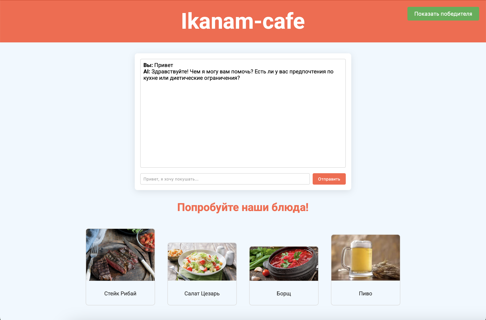

# 🍽️ SBS LLM: Side-by-Side AI Dish Assistant

**Голосуйте за лучшие кулинарные рекомендации!** SBS LLM — интерактивный ИИ-сервис для ресторана "Ikanam-cafe", помогающий гостям выбрать блюдо через сравнение ответов двух языковых моделей с системой голосования.

## ✨ Особенности

- **Двойные ИИ-рекомендации** — одновременный вывод ответов от GigaChat и YandexGPT
- **Интерактивное голосование** — пользователи выбирают лучший вариант
- **Лидерборд моделей** — автоматический подсчёт голосов и определение победителя
- **Контекстные подсказки** — анализ меню ресторана "Ikanam-cafe"
- **Визуализация блюд** — показ рекомендуемых блюд с описанием и ценой


## 🧠 Технологический стек

- **Бэкенд:** Python 3.10+, FastAPI, Uvicorn
- **Фронтенд:** HTML5, CSS3, JavaScript
- **ИИ-модели:** GigaChat, Yandex GPT


## 🚀 Инструкция

### Предварительные требования:
- Python 3.10+
- Аккаунты для API:
    - GigaChat API
    - Yandex Cloud API

### Установка
1) Клонируйте репозиторий
```
git clone https://github.com/somsersan/Neiro-cafe
```
2) Установите зависимости
```
cd Neiro-cafe
cd backend
pip install -r requirements.txt
```
3) Создайте файл `.env` в директории backend со следующими переменными:
```
GIGACHAT_AUTH_KEY=your_gigachat_auth_key
YANDEX_OAUTH_TOKEN=your_yandex_oauth_token
YANDEX_FOLDER_ID=your_yandex_folder_id
```

### Запуск бэкенда
1) Откройте новое окно терминала
2) Откройте директорию `backend`
```
cd Neiro-cafe
cd backend
```
3) Запустите файл `main.py`
```
python main.py
```
*Сервер запустится на `http://localhost:8000`*

### Запуск фронтенда
1) Откройте новое окно терминала
2) Откройте директорию `frontend`
```
cd Neiro-cafe
cd frontend
```
3) Запустите фронтенд
```
python -m http.server 8001
```
*Откройте в браузере `http://localhost:8001`*


## 📊 Механика работы системы голосования

- Пользователь задаёт вопрос о блюде
- Система параллельно запрашивает GigaChat и YandexGPT
- Ответы моделей отображаются side-by-side
- Пользователь выбирает лучший ответ
- Голос сохраняется в системе
- Статистика обновляется в реальном времени


## 🖥️ Интерфейс пользователя

- Чат-интерфейс для общения с ИИ
- Двойная панель ответов для сравнения рекомендаций
- Кнопки голосования под каждым ответом
- Галерея блюд с описанием и ценами
- Панель победителя с текущей статистикой


